# EE675 final project

## Project Presentation
*Decoding intended direction in handwriting*

---

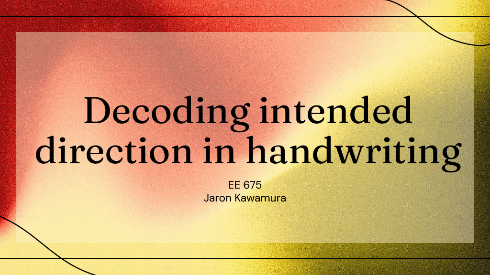

 

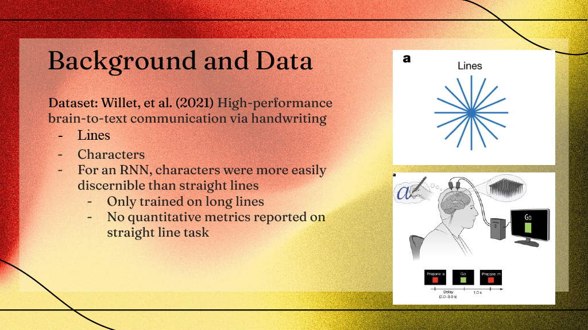

 

 

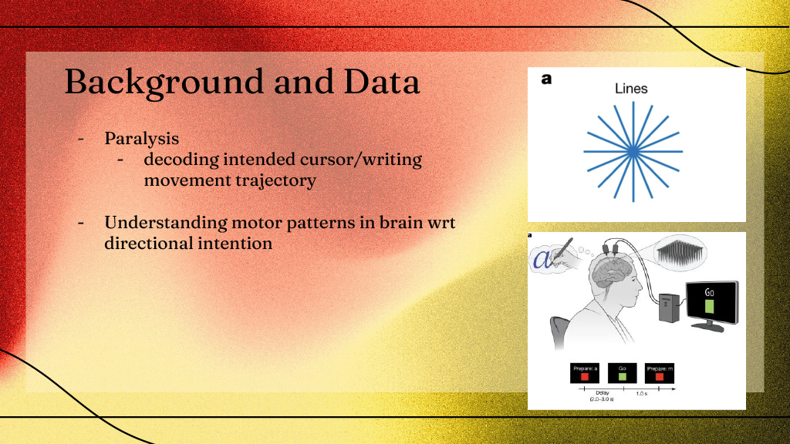

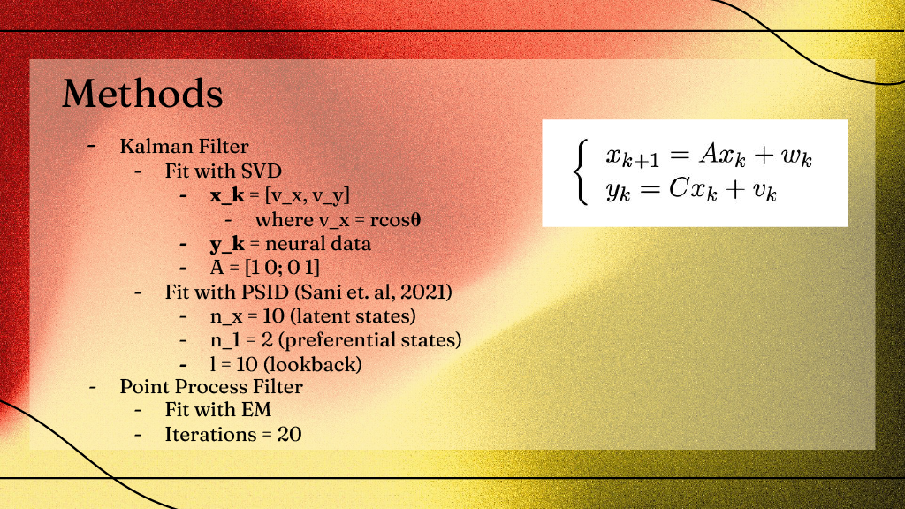
 
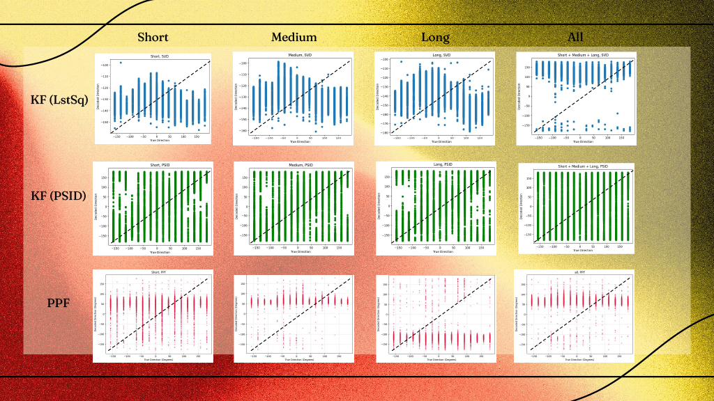
 
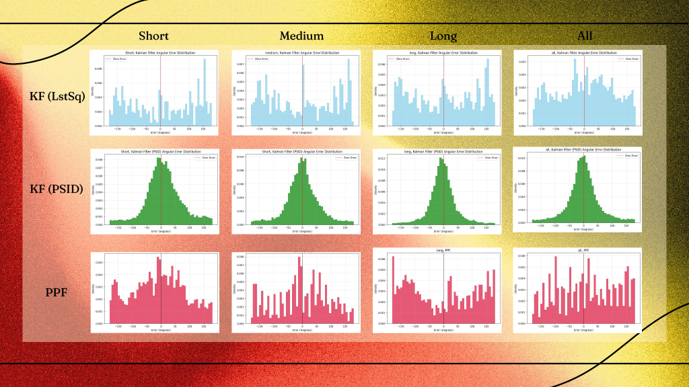
 
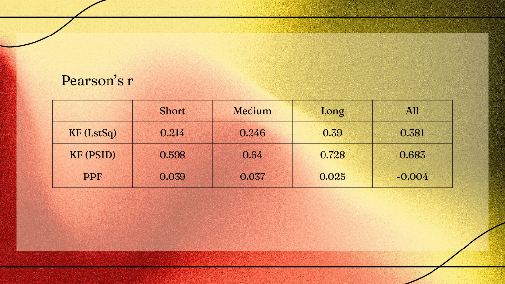
 
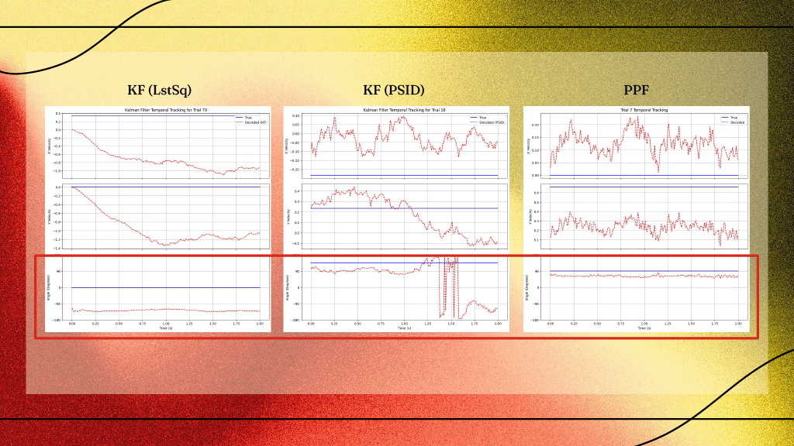
 
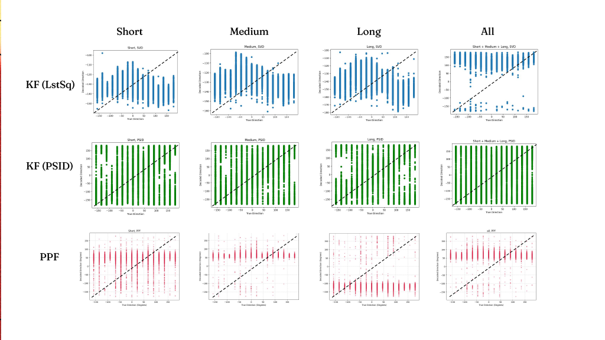
 
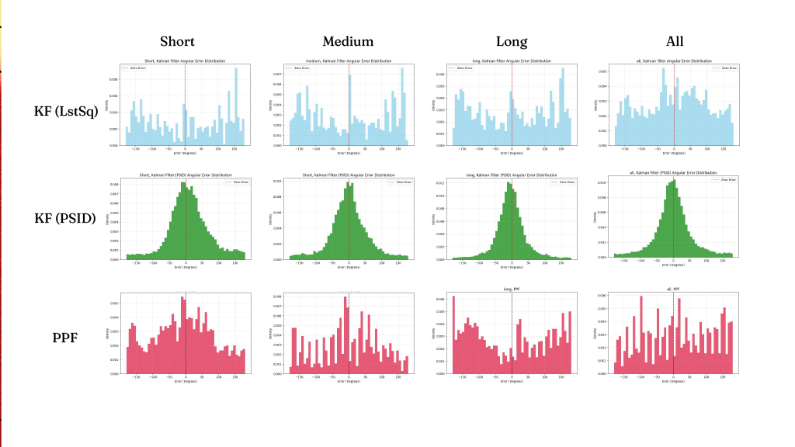
 
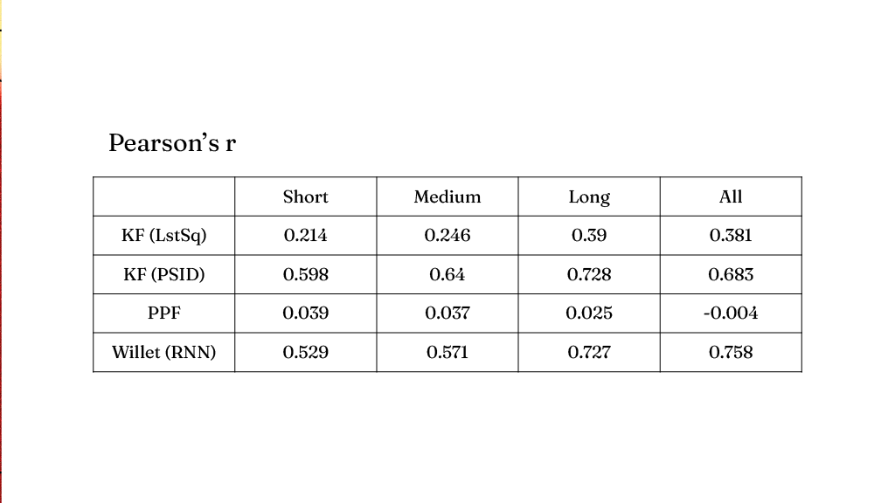
 
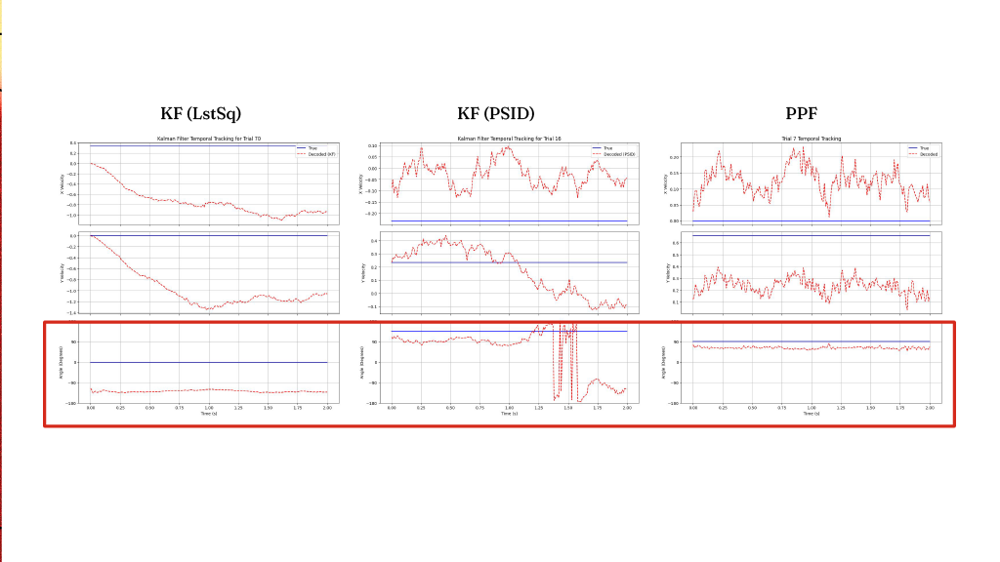
 
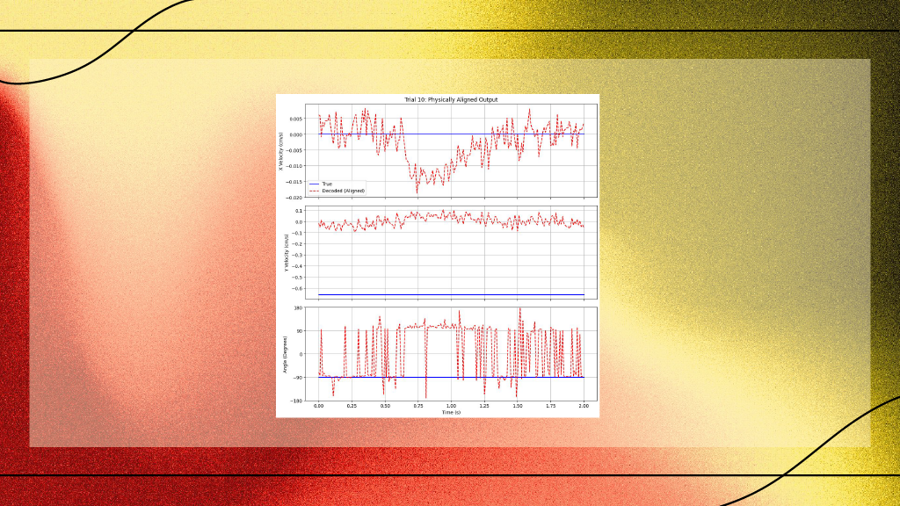
 
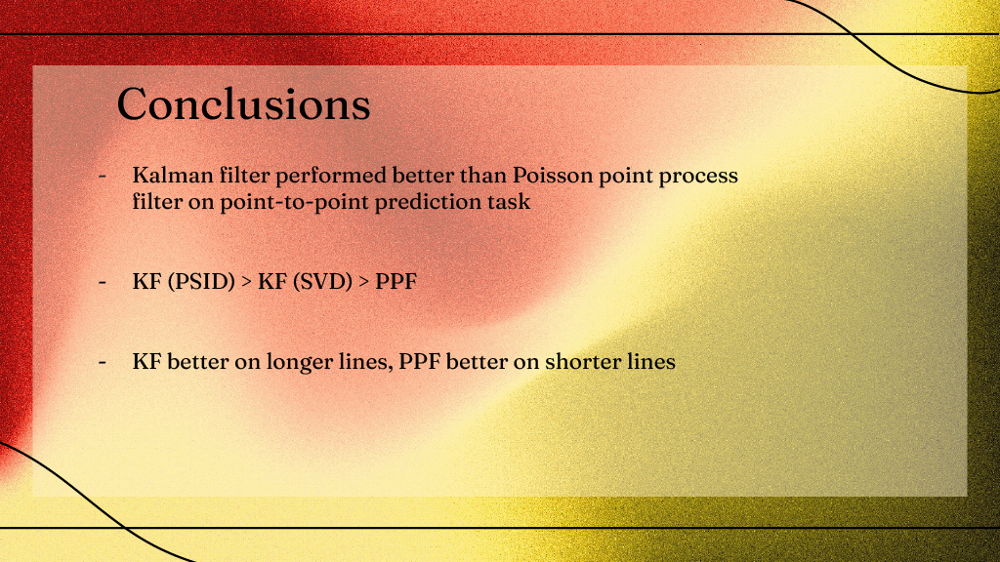
 
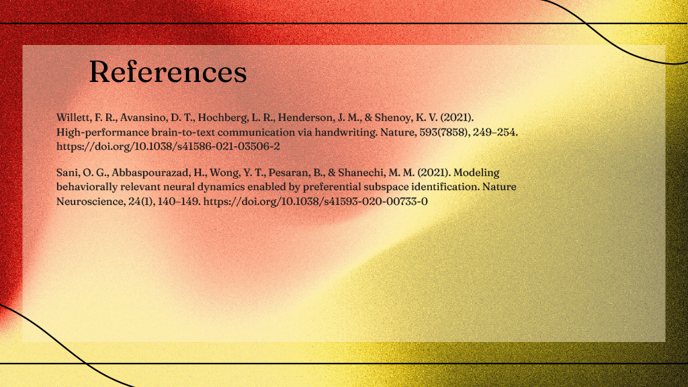
 

## References & Acknowledgments

This project utilizes data and architectural concepts from the **Willett et al. (2021)** study on high-performance brain-to-text communication.

* **Dataset:** [Handwriting BCI Data](https://doi.org/10.5061/dryad.wh70rxwmv)
* **Paper:** Willett, F.R., Avansino, D.T., Hochberg, L.R. et al. *High-performance brain-to-text communication via handwriting.* Nature 593, 249–255 (2021). [https://doi.org/10.1038/s41586-021-03506-2](https://doi.org/10.1038/s41586-021-03506-2)

Prepared with assistance of Google Gemini 3.1
